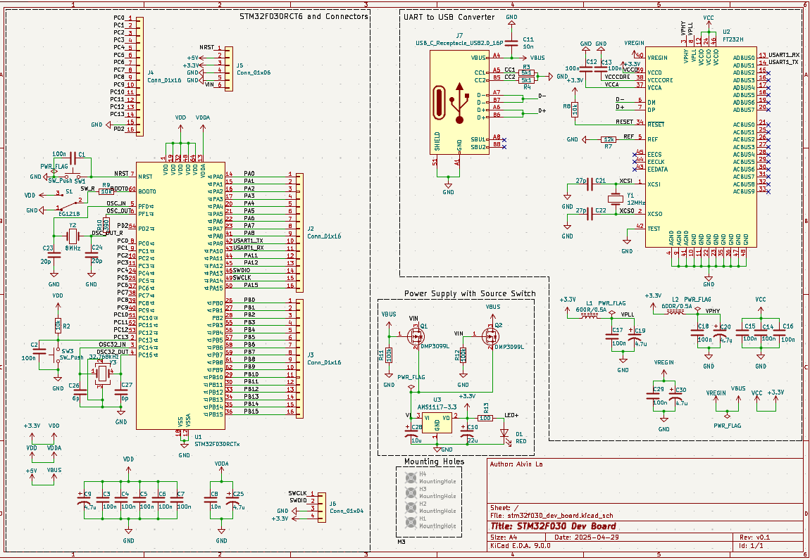
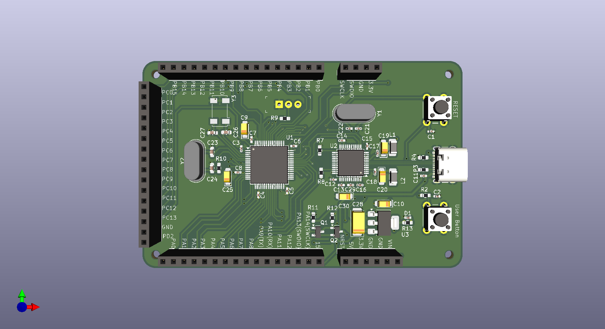

# STM32F030 Dev Board

This is a custom development board for the STM32F030RCT6 with USB-C and FT232H for USB-to-serial communication and SWD ports for debugging. Designed as a 4-layer board.

---

## 📷 Schematic

---

## 🖼️ PCB Layout

### 2D Layout:

### 3D Preview:

---

## 🔧 Stackup

- Layer 1 (Top): Signal + GND pours
- Layer 2: GND
- Layer 3: Power (3.3V plane)
- Layer 4 (Bottom): Signal + GND pours

---

## 📌 Features

- STM32F030RCT6 (64-pin LQFP)
- USB-C for power and data
- FT232H for USB-to-UART
- SWD ports for debugging
- Decoupling and filtering capacitors throughout

---

## 💡 Status

- ✔️ Schematic complete
- ✔️ PCB layout complete
- ❌ Via Stitching in progress
- ❌ Testing and fabrication in progress
